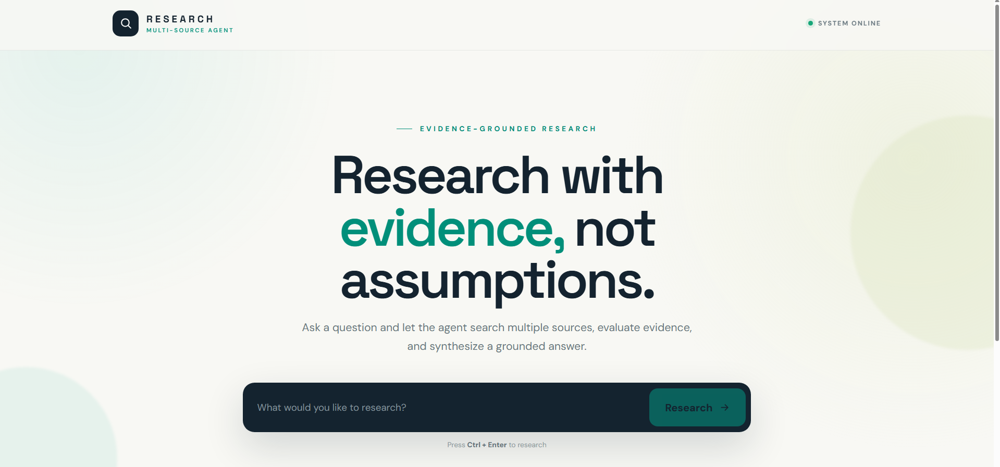
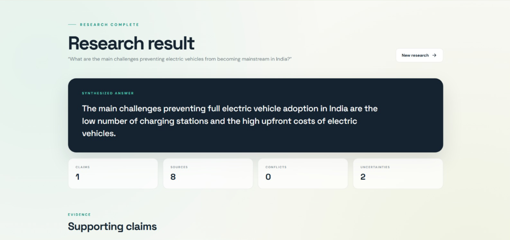

# Multi-Source Web Research Agent

A web research agent that uses multiple search providers and an LLM to answer research questions using retrieved source evidence.

## Demo

[🎥 Demo Video](YOUR_DEMO_LINK)

## Screenshots

### Research Input



### Research Result



---

## How It Works

The research flow is:

```text
Question
   ↓
Multiple Search Providers
   ↓
Deduplication
   ↓
Source Ranking
   ↓
Source Fetching
   ↓
Evidence Extraction
   ↓
Evidence Verification
   ↓
Conflict Detection
   ↓
LLM Synthesis
   ↓
Answer + Claims + Sources + Uncertainties
````

The main pipeline is implemented in `app/core/pipeline.py`.

---

## Architecture

The project separates the main research stages into independent modules:

* `providers/` - search provider implementations
* `processing/deduplication.py` - removes duplicate results
* `processing/ranking.py` - ranks sources using relevance and quality
* `processing/fetching.py` - fetches and extracts readable webpage content
* `processing/evidence.py` - extracts evidence from source content
* `processing/verification.py` - checks evidence relevance and detects possible conflicts
* `synthesis/` - generates the final answer using the LLM
* `core/pipeline.py` - coordinates the complete workflow

---

## Key Design Decisions

### Multiple Search Providers

The pipeline requires at least two search providers. They are executed independently, so a failure in one provider does not stop the others.

### Deduplication

Results from different providers can point to the same page. Results are normalized and deduplicated before sources are fetched.

### Source Ranking

Sources are ranked using:

* Relevance to the research question
* Source quality

The ranking uses deterministic rules so that the selection is easy to understand and reproduce.

### Evidence Before Synthesis

Source pages are fetched and evidence is extracted before calling the LLM.

The evidence is checked for meaningful overlap with the research question. If no relevant evidence is available, the LLM synthesis step is skipped.

### Conflict Detection

The system checks for possible numerical conflicts between evidence from different sources. Conflicts are reported rather than silently choosing one source.

---

## Reliability

The pipeline handles common failures such as:

* Search provider failures
* Request timeouts
* Source fetch failures
* Retryable errors
* Empty search results
* Missing relevant evidence

Failures are recorded as uncertainties and the pipeline continues when possible.

---

## Technology

* Python
* FastAPI
* httpx
* BeautifulSoup
* Pydantic
* Google Gemini
* React
* Vite

---

## Setup

### Backend

```bash
python -m venv venv
```

Windows:

```bash
venv\Scripts\activate
```

Install dependencies:

```bash
pip install -r requirements.txt
```

Create `.env` using `.env.example` and add the required API keys.

Run:

```bash
uvicorn app.main:app --reload
```

### Frontend

```bash
cd frontend
npm install
npm run dev
```

---

## Example

**Question**

```text
What are the main challenges preventing electric vehicles from becoming mainstream in India?
```

The application returns:

* Synthesized answer
* Supporting claims
* Sources
* Conflicts
* Uncertainties

---

## Testing

Tests are included for the main processing and pipeline components.

Run:

```bash
pytest
```

---

## Limitations

* Evidence verification currently uses lexical matching rather than semantic verification.
* Conflict detection focuses on obvious numerical differences.
* Some websites may block automated requests or require JavaScript rendering.
* Source quality is based on explicit heuristics and is not a complete credibility assessment.

---

## Future Improvements

* Semantic evidence verification
* Better source credibility scoring
* Improved handling of JavaScript-rendered pages
* Stronger claim-to-evidence mapping
* Better conflict detection
* Query decomposition for complex questions

---

## Implementation

I implemented the research pipeline, including multi-provider retrieval, result processing, source fetching, evidence extraction and verification, conflict detection, retry handling, and LLM synthesis.

The main design choice was to keep retrieval and evidence processing separate from the LLM. The LLM is only called after relevant evidence has been found.

